# NJ Boaters Exam Guide

## Before Getting Boat Underway

### Side of boat

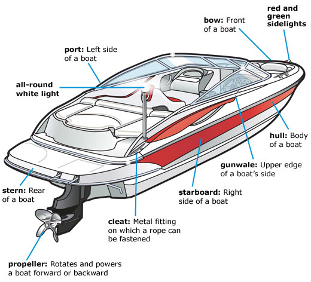</img>

#### Terms

- bow: front of vessel
- stern: rear of vessel 
- port: left of vessel
- starboard: right of vessel
- cleat: metal fitting on which rope can be fastened
- hull: body of the boat
- gunwale: boat's upper side edge
- propeller: propulsion device attached to the engine producing acceleration
- all-round white light: light on the vessel that is all round, white, usually elevated, required on all vessels?
- red and green sidelights: lights on the front of the vessel that are red and green and one on each side
- bowstop: tip of the boat

### Front of Boat

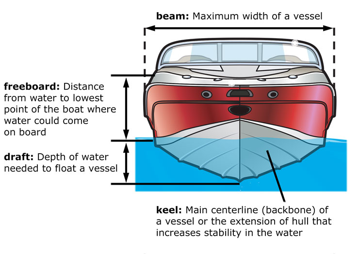</img>

#### Terms

- beam: max width of the vessel
- freeboard: the distance between the water and the maximum height of the boat
- keel: The portion of the hull that is the main centeraline or the extension of the hull that gives the boat more stability
- draft: the minumum depth of water required to float a boat

### Hulls

There are two types of hulls: displacement and planning

#### Displacement Hulls

Displacement hulls are designed to cut through the water and move the water aside, requiring less propulsion. 

The weight of the displaced water should be equal to the weight of the boat
- Physics check on that? 
- requires symetry right?
- doesn't count persons or objects on the boat?

Sailboats and large cruisers have displacement hulls, allowing travel through water more smoothly.

#### Planing Hulls

Planing hulls are designed to rise above the water and glide accross it, allowing for higher speeds. 

Most planning hulls are flat or vee shaped. 

Most motorboats, personal watercraft (PWC) and small sailboats have planning hulls.

Planing hulls will also displace water at low speeds or at rest.

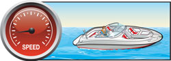</img>

Your planing boat hull enteres plowing mode when the bow of the boat rises high above your line of sight and obstructs vision. Careful driving, proper acceleration and speed management should prevent plowing mode. Reaching this mode presumably depends on the type of boat, the speed, the acceleration, weight of the boat, etc...

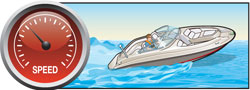</img>

Your boat with a planing hull enters planing mode when the hull rises above the water line and is propelling forward with the inboard water jet. Reaching this mode presumably depends on the type of boat, the speed, the acceleration, weight of the boat, etc...

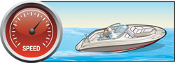</img>

#### Hull Shapes

<table>
    <tr>
        <td>Shape Name</td>
        <td>Hull Type</td>
        <td>Advantages</td>
        <td>Disadvantages</td>
        <td>Picture</td>
    </tr>
    <tr>
        <td>Flat Bottom</td>
        <td>Planing</td>
        <td>Has a shallow draft, making it good for swamps and shallow lakes/marshes/rivers</td>
        <td>Rides roughly on choppy waters</td>
        <td>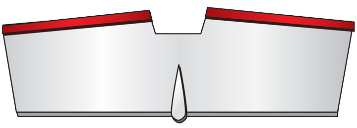</img></td>
    </tr>
    <tr>
        <td>Vee / Deep Vee</td>
        <td>Planning</td>
        <td>More stable than flat bottomed in rough water</td>
        <td>Has the tendency to roll or bank on sharp turns. Requires more power to propel than an equal flat bottomed hull</td>
        <td>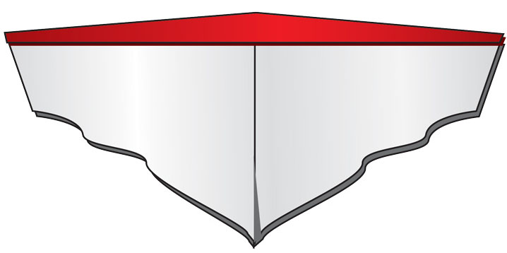</img></td>
    </tr>
    <tr>
        <td>Round Bottom</td>
        <td>displacement</td>
        <td>Moves smoothly through shallow waters even at slow speeds</td>
        <td>Has the tendency to roll unless the keel is deep or there are added stabilizers</td>
        <td>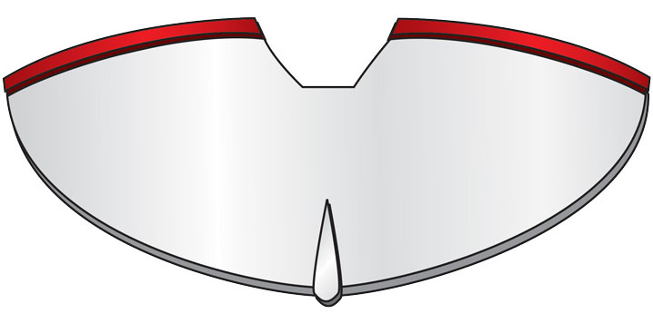</img></td>
    </tr>
    <tr>
        <td>Double Hull (i.e. Catamaran)</td>
        <td>Displacement</td>
        <td>Very smooth and stable because of wide beam</td>
        <td>Requires a wide area to turn</td>
        <td>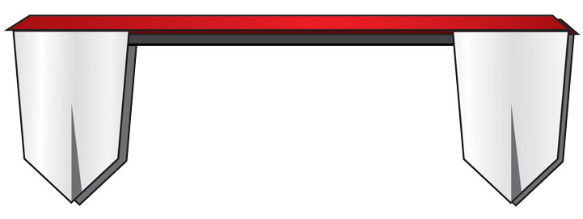</img></td>
    </tr>
</table>

#### Terms

- PWC: personal watercraft. A small vessel which requires a person or persons to operate on the vessel rather than inside and uses an inboard jet drive as a primary mechanism of propulsion. 

### Boat Length

A boat's length is measuresd from bow to stern, not including any bowstrings, rudders, outboard motors, handles or attachments.

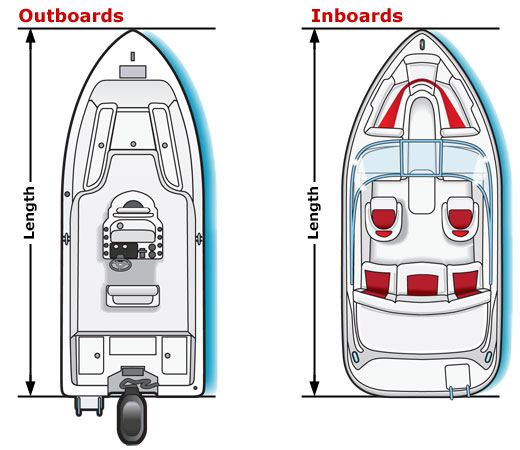</img>
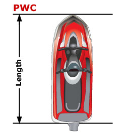</img>

There are different classes of length which are no longer recognized by the coast guard

<table>
    <tr>
        <td>Class</td>
        <td>Length</td>
    </tr>
    <tr>
        <td>Class A</td>
        <td>Less than 16 ft</td>
    </tr>
    <tr>
        <td>Class B</td>
        <td>16 feet to 25 feet</td>
    </tr>
    <tr>
        <td>Class C</td>
        <td>26 ft to 39 ft</td>
    </tr>
    <tr>
        <td>Class D</td>
        <td>40 ft to 64 ft</td>
    </tr>
</table>

#### Terms

- rudder: steering device; usually a metal plate installed vertically at the stern of the vessel

### Engines and Drives

#### Outboard Engines

Outboard engines are self-contained engines that get installed on the transom of the boat. 

Newer outboard motors are either newly designed two stroke motors that have around 75% better fuel efficiency or four stroke motors compared to the traditional two-stroke system. 

A four stroke motor is comprised of 4 stages: intake, compression, ignition and exhaust. The crankshaft will rotate once during intake, where the pistok will expand and fuel enters the cylinder. The crankshaft will finish it's rotation, compressing the intaked fuel witin the cylinder. Then, ignition will occur, to which the crankshaft rotates again and the piston expands, combusting the fuel and translating the chemical energy into mechanical. Lastly, the crankshaft rotates, expanding the pisoton as the cylinder empties it's byproducts of the combustion cycle out towards the ressonator/muffler. 

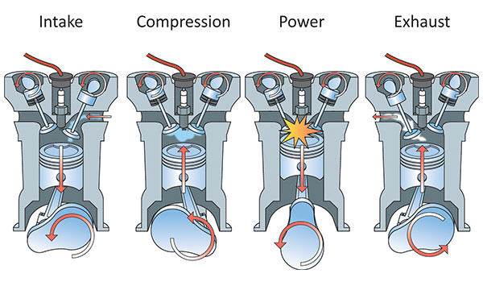</img>

A two stroke engine will have shafts along it's crankshaft where fuel is injected and in one revolution/2 piston cycles, the fuel will be intaked and ignited, and them compressed and exhausted out. This produces more power under identical cylinder sizes, allowing for smaller applicatoins, and are easier to start in cold condutions, and are cheaper but isn't as fuel efficient or durable.

Steering the outboard motor is done by the tiller, which is attached to the steering wheel of the vessel usually. 

#### Inboard Engines

Inboard engines are automotive engines installed in the midsection of the hull or right behind the transom and are four-stroke engines. PWCs usually have two-stroke inboard engines. 

The driveshaft usually runs along the engine to the propeller in the stern, and there is a rudder behind the propellor used for stearing. 

Newer inboard PWC engines also have more fuel efficient direct-injection designs. 

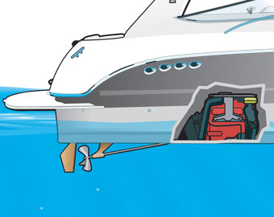</img>

#### Sten Drives

Stern drives, also called inboard/outboard engines, combine elements from both inboard and outboard engines.

Inboard qualities:
- Stern drive engines are installed inside the hull, through the transom to a drive unit or an outdrive
- Stern drive engines are four stroke automobile engines
- These engines are quieter and more fuel efficient

The engine is attached to the outdrive through a drive shaft, and that controls the propellor and the outdrive swivels like an outboard engine. 

#### Jet Drives

Jet drives differ in steering and propulsion. Instead of a propeller, there is an impeller, which is an engine-powered water pump that sucks in water under pressure through the bottom of the vessel and propels it outward in the rear. The direction of the water propulsion out the stern determines the direction of stearing. 

There can be an inboard version of this too, where the impeller is located inside the vessel, and there is an intake grate on the side to pull the water into the impeller and blocking large debris. 

These types of engines are good in shallow water conditions. 

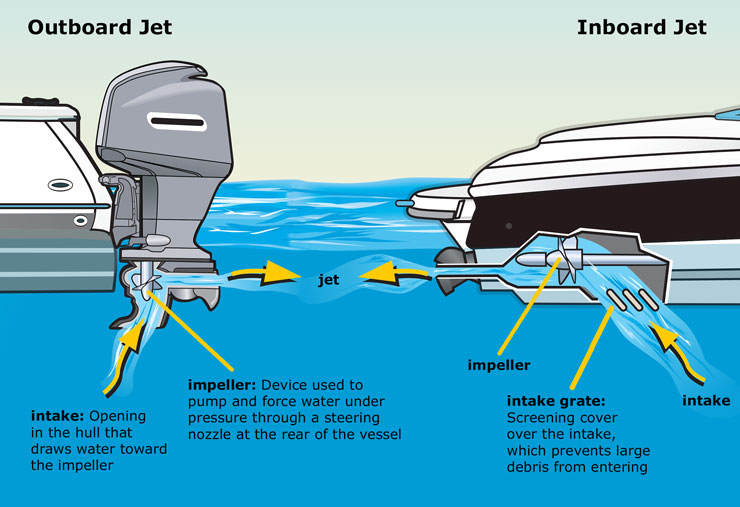</img>

#### Terms

- transom: the vertical metal plate installed at the stern of the vessel for outboard motor installations
- tiller: The horizontal rod attached to an outboard engine that gets shifted horizontally to turn the direction of the entire outboard motor, thus changing the vector of propulsion force and thus steering the vessel. This can be done manually on smaller vessels or done via a steering wheel on a larger vessel. 
- skag: the bottom metal plate below the prop
- telltale: the hole in the engine where you should see water is coming out of to ensure it's pumping properly.

### PWC

Any inboard vessel that's less than 16ft. 

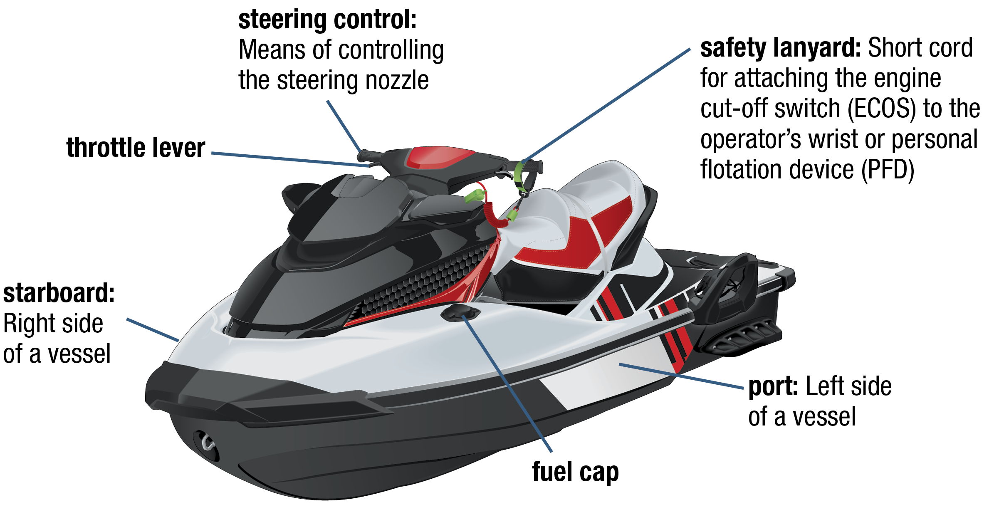</img>
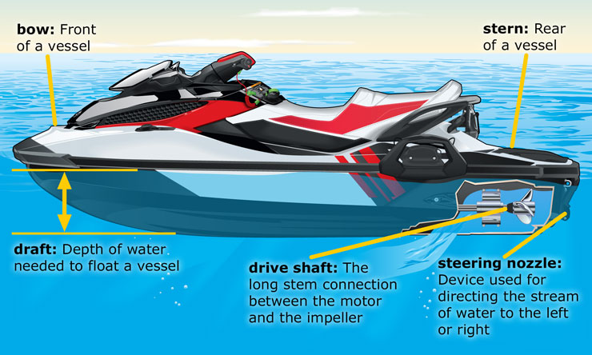</img>

#### Terms

- safety lanyard: a lanyard that attaches the engine control cutoff switch (ECOS) to the  wrist of the operator or PFD (personal flotation device)
- steering control: the handles for steering
- throrttle lever: lever located right below the right steering control handle to throttle engine
- drive shaft: the long stem that connects the engine to the impeller
- steering nozzle: the nozzle directing the water from the jet drive stream out the stern of the boat, steering it based on it's angle

### Sailboat 

</img>

#### Terms

- Halyards: Lines used to lower/raise sails
- sheets: used to control angle to the sails and the wind

### Capacity Plate

The boat's capacity plate contains the number of passengers that can safely be aboard the vessel and/or the maximum weight supported (including engine, attachments, gear, persons, etc...). The capacity plate may also contain non-gear weight as well as the max horsepower rating for the vessel. PWCs and sailboats do not need to abide by this requirement.

All boats less than 20ft must have this capacity plate as per NJSP, but according to a federal org (National Marine Manfufacturers Association, NMMA), all boats 26ft or less must have this plate. 

If there is no capacity plate, you can estimate the max # of persons that can safely board the vessel based on the following equation:

Max # of passengers = area ft^2 / 15 = length_ft * width_ft / 15

Boats that do not abide by capacity plate requirements have a higher risk of swamping or capsizing. 

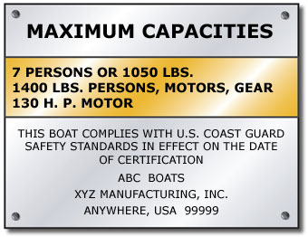</img>

#### Terms

- swamping: boat filling up with water
- capsizing: boat flipping

### Float plans

Float plans should be created before any type (short or long) trip starts and sent to someone (friend, family, marina, coast guard, NJSP) before-hand. The person then should be contacted after the trip concludes, so they know to alert NJSP if you do not alert them in time. The float plan could include:

- The name of your vessel
- The registration of your vessel 
- The make, model, type, engine type, color, engine horsepower, and other identifying elements of your vessel
- The destinations of the trip
- The timings of the trip
- All of the passengers who would be on board
- Phone numbers of NJSP / Coast guard who to contact
- Description of trailer and automobile, including license plate
- Survival/Communications gear manifest

### Fueling the boat

#### Before Fueling Checklist

1. Get everyone off of the boat
2. Turn off any electronics
3. Turn off gas burners or pilot light
4. Close doors and windows to prevent fumes from entering the vessel
5. Ensure the fuel lines and connections are all attached properly and are in good order
6. Ensure no one is smoking or lighting matches/lighters on dock
7. Remove portable fuel tanks
8. Make sure fire extinguisher is in close reach
9. Tie the boat down to securely to the fuel dock

#### While fueling your boat checklist

1. Ensure the fuel nozzle is fully in the gas cap and hold steady to give it static spark
2. Ensure no water gets through the water or bilge
3. Wipe up spilled fuel and dispose of rags/paper towels properly
4. Use caution to fill slowly and leave some room in the tank

#### After fueling boat checklist

1. Open doors and windows to ventalate fumes
2. Smell fumes in engine compartment and bilge and keep ventilating until there are no more odors, don't turn on until odors clear. Potentially get a vapor detection system. Fumes are heavier than air and settle at the bottom in enclosed areas.
3. Fully fasten gas cap
4. Turn on exhaust blower/power ventalation system for 4 min before turning on engine if boat is equipped with one
5. Start engine and reload passengers

#### Fueling PWC checklist

1. Do not tip the PWC to get more fuel, there must be space left in the tank
2. Ensure fuel nozzle is firmly in place
3. Wipe off any oils left
4. Avoid spills in water
5. Check everything for leaks, including fuel lines and connections
6. Open door to engine compartment and smell for gas/fumes, and ventilate fully before starting the engine. 

### Launching/Docking

#### Before Launch

- Tie rope to vessel to control during launch
- Ensure the boat is packed up fully with all gear
- Ensure gear is secured
- Ensure you have a ball hitch that fits the coupler
- Ensure trailer lights are working
- Ensure tongue capacity is not exceeded on the vehicle, hitch, bumper, coupler and trailer. Tongue weight should be 10% of vessel + trailer + gear
- Ensure the coupler is rated for the vehicle and boat
- Ensure trailer is rated for the boat
- Ensure hitch pin is in
- Ensure boat is tied down with straps
- Ensure chains, which should be rated to hold double the weight of the boat, trailer and vehicle, are criss crossed under the coupler
- Ensure tires and lug nuts are on securely 
- Turn wide, manage distance accordingly and move slowly
- Ensure engine is up
- DRAIN FUCKING PLUG!!!!!!!!

#### In parking log

- Don't launch yet
- Ensure straps are off
- Ensure all gear is moved from car to boat
- Disconnect lights from trailer
- DRAIN FUCKING PLUG!!!!!!!!

#### Launching

- DRAIN FUCKING PLUG!!!!!!!!
- back boat up into water such that the the boat floats
- Engage e-brake
- Tie boat to trailer and dock
- Drop engine
- unhook winch
- loosen wench
- reverse boat out and come back around when car is parked and person is ready to be picked up
- get off the launch

#### Docking

- Back trailer up until bunks are 60% in water
- back boat up onto trailer
- attach winch
- turn engine off, raise it
- use winch to pull in boat, don't accelerate
- get off launch

#### Docking - after
- straps, hitch pin, chains, pack gear up, careful driving
- dispose of all weeds
- remove drain plug

#### Terms

- tongue capacity: the capacity which is beared down on the coupler

### Knots

- (square knot)
- (two half hitch)
- Figure Eight Bend
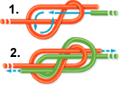</img>
- Bowline
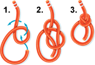</img>
- Clove Hitch
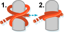</img>
- two half hitch with round turn
</img>
- Cleating hitch
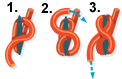</img>

### Boat Maintenance

#### Boat
Storage:
- Store in a dry area out of the sun
- Place trailer on blocks to preserve tires
- Keep boat covered but circulate air
- Clean all lines and ropes
- clean sails with soft brush and patch holes
- Supplement with owners manual maintenance 

Every Outing:
- Inspect hull for leaks
- Inspect transom for wear/tear/leaks
- Check bilge pump works
- Exampine interior and exterior
- Use env safe and non-phosophate detergents to remove oil and algae from fiberglass hulls
- Avoid corrossive/abrasive materials which could remove gel coat
- Patch holes immediately with fiberglass patching compound (yeah have that)
- Check through hull fittings
- Remove all water

Every season:
- Treat hull, gel coat

Every few seasons:

#### Engine

Every Outing:
- Inspect oil
- inspect fluids
- Check bilge pump works
- Keep fuel up, 1/3 rule (1/3 out, 1/3 back, 1/3 reserve)
- supplement with engine manual

Every season:
- Inspect engine cover for leaks/cracks/fittings
- clean engine
- tune it
- Clean battery terminals
- Remove corrosive material with a wire brush
- If engine is weak, recharge it ore replace it

Every few seasons:
- Change spark plugs
- Change propeller/impeller
- Change battery
- Water test
- Compression test

## Getting the Boat Underway

### Casting off 

#### Before Casting

- Keep the boat tied to the dock
- Ensure the exit lanes are clear
- Ensure everyone is secured and has a PFD 

#### Casting off with no wind

- Cast off bow and stern
- Accelerate forward slowly in first gear
- Turn off dock

#### Casting off with/current towards dock

- Cast off stern line
- accelerate forward in first gear until bow line reaches the middle of the boat
- Place fenders on bow
- keep accelerating and move steering wheel hard toward the dock until 45 degrees or stern is clear of dock
- Cast out bow line
- Reverse until you have room to forward turn out
- Accelerate forward slowly and turn out

#### Casting off with/current away from dock

- Cast of bow and stern
- Let wind/current take you away from dock, push off with a row/paddle
- Foward gear and accelerate and turn out

### Docking

#### Before Docking

- Before docking, determine wind position
- Reduce speed to the minimum required for steering
- Have bow and sstern lines ready
- Ensure traffic is clear before you reach your approach

#### Docking with no wind

- Ensure you reduce speed to a minimum required for steering
- Come in at a small angle, roughly 20 degrees
- Secure bow
- Drive forward, cutting wheel toward dock,  driving stern in, or just swing it in with a rope
- Secure stern line

#### Docking with wind toward dock

- Drive slowly, reducing speed with reverse gear to a stop until parallel to dock
- Then let wind/current bring you into the dock
- Secure bow and stern lines

#### Docking with wind away from dock

- Drive in slowly at a 40 degree angle, then stop with reverse gear
- Secure bow
- Put forward gear slowly until stern is in 
- Secure stern line

## Navigation and Safe Operation

### US Aids to Navigation System

- Red Right Return!
- Red buoys have even numbers, green have odd numbers
- For intercoastal waters, yellow triangle means pass port side, yellow square means pass starboard
- For buoys indicating channel splits, red on green means pass it on your starboard side, green on red means pass it on port side
- black and white stripes means stay away from shore
- crossed orange diamond means there are hazards around
- non-crossed orange diamond means there are hazards inside such as rocks
- circle means controlled area: low speed, no fishing/anchoring, skiing, slow no wake, no prop boats
- square means information
- Striped buoy means mid-channel, pass on either side

### Locks, dams, and bridges

- You must wait 400ft way from a lock for the flashing signal to enter the lock
- Respond with one prolonged horn blast and one short one (i.e. for motorboat response ok signals)
- lock lights:
    - red means stay clear and dont enter
    - amber means approach slowly
    - green means enter
- Have fenders and 100ft of rope 

#### Terms
- aground: touching the ground

### Water levels
- Tides are created by sun and moon exerting pull on thearth
- High and low tides occur in 6 hour intervals

### PWC
Before going out
- Commit owners manual to memory, read it
- use type I PFDs
- Review PWC manufacturer video
- Be aware of local, state and federal laws that apply to a PWC
- You must have a whistle, fire extinguisher, flag and paddle before heading out
- Must check the signaling before heading out
- Must attach ignition switch safety lanyard to PFD, ensure ECOS works properly and is installed
- Inspect PWC, maintenance it regularly, and keep it in good operating condigion
- Be aware of local, state and federal PWC laws
- Children who can't put both feet on footrests and hold onto the other person should not ride
- Wear wetsuit and protection as jets can injure you
- Don't exceed max weight capacity
- Know your own limits

While riding:
- Most modern PWCs have assisted steering and braking
- Give plenty of room to stop, even with assisted braking
- Keep away from the steering nozzle, as you can get caught in engines
- PWCs must be powered to steer as they have no rudder
- Never use reverse to stop a PWC or people could get flung off
- Do not ride closely to other PWCs or boats, it causes blind spots
- Always look around you before making turns, and Be aware of all traffic, not just ahead
- Do not make quick turns
- Always hold onto the other person fully while keeping feet on footrests
- if capsized, look for decal that shows which way to roll PWC or check owners manual
- Reduce noise by not going by campers, not traveling in groups, not lingering in the same spot
- Do not ride wake or intentionally wake others
- Make sure water is at least 30 inches deep
- Don't create wake near shores
- Dont' operate at very low speeds
- Do not dock in grass

After riding:
- Shut off engine and clear pump after riding

### Propeller Strike Safety and boat safety on water

- Turn off engine when people are boarding/offboarding or when people are in the water behind the boat
- Never start boat with engine in gear
- Never ride on a seat back, gunwale, transom or bow
- Make sure all passengers are seated proeprly before getting underway
- Assign responsibule adult ot watch children and the boat, sound alarm if child falls
- Maintain properly lookout
- Slowdown during congestion and anchorages
- Recognize warning byoys and mark swimming and other hazardous areas
- Keep boat away from swimming areas
- **Look for red flag with white diagonal stripe and blue/white alfa flag (must be used on federal waters) signaling that divers are down**
- Ensure propeller strike equipment is installed:
    - Guards that form a physical barrier
        - Deflection devices, cages, ring guards, ringed props, kort nozzles
    - Jet drives and pump jets
    - Interlocks: devicses that automatically turn off engine or sound alarm
    - ladder interlock
    - Sensors: work by boaters that shut off engine or trigger alarm
- NEVER let go from steering wheel, avoiding circle of death: let go of steering wheel, wheel cuts left flinging you off, boat travels in circle to come around and kill you
- You may not travel at a high rate of speed within 200ft of a pier, marina, dock, or wharf

## NJ Laws

### Boat ID
Following vessels exempt from registration:
- Non-powered vessels 12 ft or less 
- non-powered inflatable vessel
- non-powered keyek or canoe
- non-powered sailboat for use on laks or ponds in private lands
- vessels registered in another state

### Registration num and decals
- You get a registration card and decals every year from MVC
- You must display the registration number and validation decal on both sides of the bow
- Numbers must be in  three inch block letters
- Numbers must be contrasted with background
- Letters must be separated from numbers with hyphen or space
- Decal must be 3 inches aft of the registration numbers

#### Terms
- Aft: closer to the stern

### Titles 
- All vessels longer than 12 feet must be titled
- All titled vessels must be registreted
- All powered vessels regardless of length must be registered and titled
- Change of address requires 7 days notice

### Hull ID number
- Distinguish one veessel from another
- Are engraed on fiberglass or metal plate permanently attached to the stern starboard side of the transom
- Must appear on registration applicatoin

### Age requirements
- No child under the age of 13 can operate a powered vessel in NJ
- 13-15 ages can operate a 12 ft or under boat if it's motor is a trolling motor with HP <= 1
- 13-15 ages can operate > 12 ft if motor is trolling motor w/ HP <= 10
- You must be 16 or older to operate a PWC or motorboat otherwise

### You may ride a boat from other states if
- you are in nj for less than 90 days
- Possess certificate issued by state
- Possess proof of successful completion of boat safety ourse from another state

### Careless driving
- Jumping wakes
- operating in prohibited areas
- weaving through congestion
- creating heavy wake in certain situations
- approaching within 50 ft of a divers flag
- steering towards person or object in the water
- Chasing, harassing or distriurbing wildlife
- disattached EOCS lanyards
- Not traveling at slow speed/no wake when:
    - Vessels not under command such as anchored vessels
    - work barges or floats engaged in construction
    - emergency vessels flashing lights
    - within 200ft of marina, pier, dock or wharf
    - through bridge openeings of 400ft or less in width
    - through lagoons, canals or confide areas less than 200 ft in width
- Overloading: operating beyond capacity
- Riding in an unsafe position: on bow, gunwales, tops of seat backs or in positoins that can risk going overboard
- Insufficient PFDs, fire extinguishers, backfire flame arrestors, ventillation or navigation lights
- Fuel leaks or fuel in bilges
- Impede other vessels
- Anchror vessel that impedes other vessels
- Moor to a non-mooring buoy, beacon, light, or nav aid
- mess with nav aids
- obstruct pier, wharf, boat ramp or facility

### Alcohol
- 0.08% BAC
- Implied consent applies to going on waters 
- If you are convicted of drinking and driving, you lose your boating license for 1 year and your driver's license for 3 months
- Higher BAC could result in 7 to 12 month drivers license restrictions

### Homeland Security 
- Within 500 yards of a military vessen, you must travel at low speed no wake
- Within 100 yards of a military vessel, you must come to a complete stop and must keep out from this zone
- To pass, must contact navy or USCG on VHF-FM channel 16
- avoid cruise lines or other ports
- avoid dams, power plants, etc...
- do not anchor beneath bridges or in a channel

### waterway watch
- Contact 1877 24 WATCH to report suspicious activity

### PFD
- Must be of proper type
- Must be readily available
- Must be in good conditoin with no rips or tears
- Everyone 12 and younger must have a PFD on, although everyone is encouraged to wear one
- Must have at least one type I, II, III or V PFD for each person
- All 16 ft or longer vessels must have one throwable type IV 
- Each person on a PWC must war type I/II/III/V PFD
- All people on skis must wear Type I/II/III/V

#### PFD Types
- Type 1 best, for rough remote waters
- Type 2 will turn unconscious wearers face up
- Type 3 is for water skiiers, inflate when you enter water, used for quick rescues or shallow water
- Type 4 is thorwabile ring or cushion
- type 5 is for special windsurfing, kayaking or water skiing

### Fire extinguishers

#### Types
- Type A: Fires of solids like woods. Number relates to how many gallons of water is equal to
- Type B is for flammable liquids such as ggas or oil. Numbers tells square footage of fire
- Type C are for electrical fires

#### Vessel Requirements
- Any inboard ingine
- Closed compartments where fuel tanks are stored
- Double bottoms not sealed to the hull or not filled completely with flotation material
- closed living psaces
- flammable materials
- permanently installed fuel tanks

#### Type Requirements

Without fixed system
- less than 26 ft: one 5-B
- 26-39: two 5-B or one 20-B
- 40 to 64: three 5-b or one 20-b and one 5-b

With fixed system
- less than 26 ft: none
- 26-39: one 5-b
- 40 to 64: two 5-b or one 20-b

#### Rules
- Must be readily accessible where they can be reached
- Must not be expired
- Good condition:
    - Is charged w/ pressure gauge reading- has lock pin in place
    - does not show signs of corrosion or damage
    - hash discharge nozzle that's clear of obstructions

### Engine requirements

#### Backfire flame arrestor
- Any non-outboard must have it to prevent vapors in case engine backfires
- Must be in good servicable condition
- Must be USCG approved
- Clean flame arrestor and check for damage

#### Ventilation
- all gas vessels that entrap fumes must have two vent ducts with cowls
- At least one exhaust duct must extend from open atmosphere to lower bilge
- One intake duct must extend from midway to the bilge or below the level of carburetor air intake
- Use vent system if equipped for 4 min .when:
    - After fueling
    - before starting engine
- If no vents, i.e. on PWC, open engine compartment and sniff for fumes before starting engine

#### Noise
- All engines must be muffled
- Noise cannot exceed 9 dba
- NJSP or USCG or racers are exempt

#### Terms
- Cowls: Hooded opening designed to scoop air

### Nav lights
- lights must be visible from 2 miles away

- Must have red and green sidelights (red = starboard, green = port)
- Powered vessels: must have either an all white round light 3.3 ft higher than sidelights or a mastlight 3.3 ft higher than sidelights and a stern light
- Non-powered/sail vessels must have: red and green sidelights and a stern light (no mastlight = non-powered)
- All lights must be visible from at least 2 miles away
- Vessels under 23 ft must have a flashlight or lantern

### Waterways
Federally controlled water ways:
- coastal waters
- great lakes
- territorial seas
- bodies of water connected to one of the above, up to the point where body of water is less than 2 miles wide

### VDSs (Visual Distress Signals)
- Either day, night or both
- Either pryotechnic (smoke and flames) or non-pyrotechnic (non-cumbustible)
- All vessels on federally controlled waters must be equipped with approved VDSs
- All vessels must carry night signals when operating at night. 
- Vessels must carry day signals unless:
    - Recreational vehicles that are less than 16 ft
    - non-motorized open sailboats that are less than 26 ft
    - manually propelled vessels
- Must be USCG approved, in servicable condition and readily accessible
- minimum of 3 unexpired pyro VDSs must be carried

Day signals:
- handheld Orange smoke (pyro)
- Orange smoke that floats (pyro)
- Orange flag (non-pyro)

Day and night signals
- Red meteor (pyro)
- red flare (pyro)

night:
- electric light (non-pyro)

### Sound
- Vehicles must have horn or whistle that are less than 39.4 ft in length, including pwc
- vessels 39.4 ft or more must have sound producing device that is audible for one half mile and should last 4-6 sec

#### Sound types
- One short blast: passing on port
- two short blasts: passing on starboard
- three short blasts: I'm backing up, operating astern propulsion
- one prolonged blast at intervals of not more than 2 min: power driven vessels w/ restricted visibility
- one prolonged blast plus two short blasts at intervals of not more than 2 min: power driven vessels w/ restricted visibility
- one prolonged blast: warning sign when coming around turn or bend or exiting a slip
- five or more rapid blasts: danger, or do not understand, or do not agree with other boaters intentions

### Flags
- Red and white stripe flag means down diver
- White an dblue flag means alfa flag or downed diver, must be used in federal control waters
- Ski flag must be:
    - orange flag
    - triangular in shape, 
    - at least 12 inchesd of one dimension
    - displayed four feat abovee highest structure when towing or retrieving skiier

### VSC
- You can get free vessel safety check from USCG auxillary and us power squadron
- you get a decal if you pass

### PWC
- Cannot ride at night
- Cannot ride during visibility restriction
- Cannot ride in point pleasant or cape may canals
- Cannot operate above min headway speed within 100ft of:
    - byoy or signs
    - shoreline
    - person in water
    - residential dwelling
- When towing:
    - Must have a person onboard acting as an observer
    - PWC must be rated for it
    - Tow ropes must be not less than 35 feet, and not greater than 85 ft
    - wakesurfers can use rope not less than 8 ft

#### Terms
- Minimum headway speed is the minumum speed required to maintain steering

### Towing
- Cannot do at night
- Must keep 200ft away from marina, pier, dock, wharf, or any person in water

### Sanitation
- Every vessel 65ft or under witha toilet must have a USCG approved MSD (marine sanitation device) on board
- 3 types:
    - Type 1 and 2: found on large vessels. Treated with chemicles. Y valves must be secured by being locked or having the handle taken off
    - Type 3 either hold tanks or portable toilets. Collected wastes are taken ashore or disposed of
- Vessels 65 ft or greater must use a typew II or III
- if vessel is 26ft or longer and on federal waters, you must display a garbage disposal placard in a proiment location. IT's a durable 4x9 inch sign that notifies passengers and crews about discharge restrictions
- if 26 ft or longer on federal waters, must have a 2x8 placard on pilge pump control station stating discharge of oil prohibited text

### Aquatic niussance species
- Don't bring niusance species like zebra mussels into the state
- There are no confirmed cases
- Inspect and Wash boat and prop and engine thoroughly when coming back from out of state
- empty bait bucket on land

### Accidents
- If in an accident, stop boat, turn off engine, help victims
- give name, address and vehicle registration num
- Must contact NJSP if it involves:
    - death of person
    - disappearence of person
    - injury of person
    - property damage more than $2k